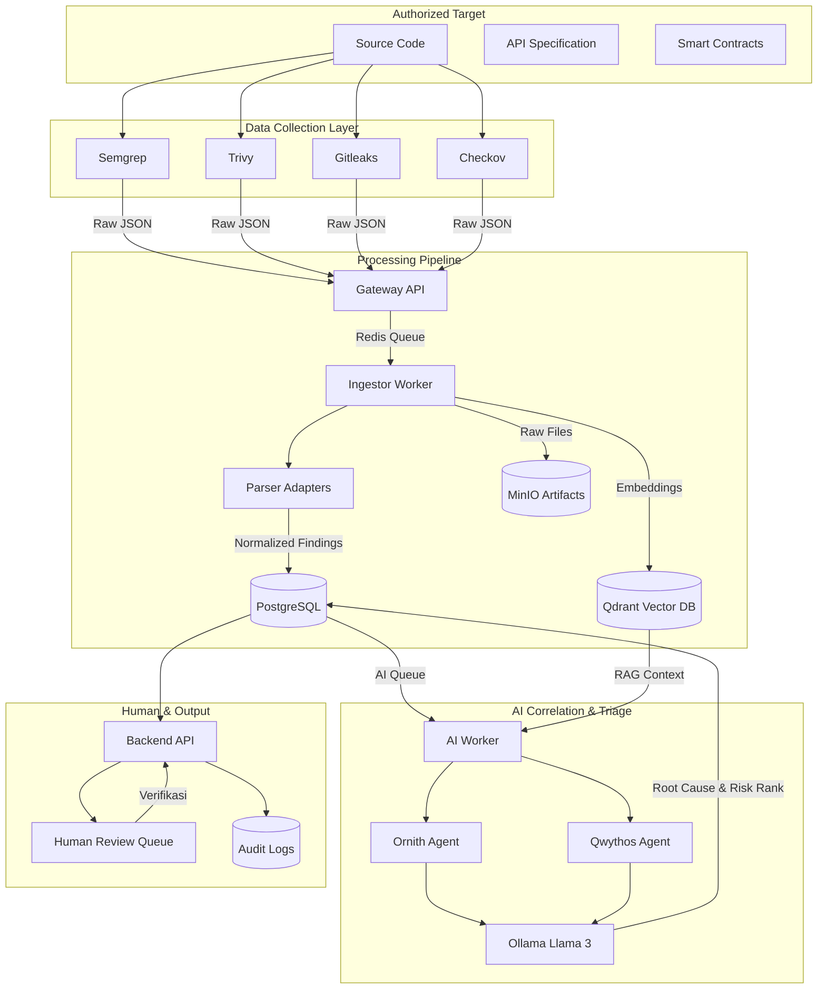

```
# Multi-Agent AppSec Automation Platform


Platform otomasi keamanan aplikasi terpusat yang mengimplementasikan arsitektur *microservices*, *Retrieval-Augmented Generation* (RAG), dan agen AI lokal (Ornith & Qwythos) untuk melakukan triase, verifikasi, dan remediasi temuan pemindai keamanan secara asinkron.

## 🔄 Arsitektur & Alur Data (End-to-End)

Sistem ini dibangun rigorously mengikuti alur kerja security pipeline:



## 🏗️ Tech Stack

### Application Layer
*   **API Gateway & Backend:** FastAPI, Pydantic v2, AsyncPG
*   **Workers:** Python Asyncio, Redis Queue (BRPOP/LPUSH)
*   **AI Integration:** Ollama (Llama 3), httpx untuk inferensi non-blocking

### Infrastructure Layer
*   **Database Relasional:** PostgreSQL 15
*   **Message Broker:** Redis 7
*   **Object Storage:** MinIO (S3 Compatible)
*   **Vector Database:** Qdrant
*   **Monitoring:** Prometheus, Grafana, Loki

### Embedded Security Tools (Inside Docker)
*   **Source Code:** Semgrep
*   **Secrets:** Gitleaks
*   **Dependencies & Containers:** Trivy
*   **IaC (Infrastructure as Code):** Checkov
*   **Container Linting:** Dockle

---

## 📁 Struktur Project

```text
platform/
├── ai/
│   ├── analyzer.py          # Logika Multi-Agent (Ornith & Qwythos)
│   ├── worker.py            # Consumer AI Queue (RAG & Correlation)
│   ├── ornith/              # Prompt khusus Ornith
│   ├── qwythos/             # Prompt khusus Qwythos
│   └── prompts/
├── backend/
│   └── api/routes/
│       └── review.py        # API Human Review Queue & Verifikasi
├── core/
│   └── config.py            # Pengaturan terpusat (Env vars)
├── gateway/
│   └── api/routes.py        # Endpoint Ingestor masuk
├── orchestrator/
│   └── worker.py            # Job puller, Git clone, Multi-scanner paralel
├── parser/
│   ├── models.py            # Model Pydantic (NormalizedFinding, Fingerprint SHA256)
│   └── adapters/
│       └── semgrep_adapter.py # Parser khusus output Semgrep
├── scanners/
│   ├── semgrep_wrapper.py   # Wrapper CLI Static Analysis
│   ├── trivy_wrapper.py     # Wrapper CLI Dependency/Config Scan
│   ├── gitleaks_wrapper.py  # Wrapper CLI Secret Detection
│   ├── checkov_wrapper.py   # Wrapper CLI IaC Scan
│   └── dockle_wrapper.py    # Wrapper CLI Container Linting
├── storage/
│   ├── schema.sql           # Schema DB (targets, scans, findings, audit_logs)
│   └── minio_client.py      # Klien upload artifact
├── vectordb/
│   ├── manager.py           # Koneksi & Collection Qdrant
│   └── embedder.py          # Generator Embedding via Ollama
└── worker/
    └── main.py              # Ingestor Worker (Otak Pipeline Normalisasi)
```

---

## 🚀 Quick Start

### 1. Prasyarat
- Docker & Docker Compose
- NVIDIA Container Toolkit (Opsional, untuk akselerasi GPU pada Ollama)
- Git (Terinstall di host, digunakan oleh Orchestrator untuk clone repo target)

### 2. Jalankan Seluruh Ekosistem
```bash
git clone https://github.com/wong1117/Toolsv2.git
cd Toolsv2

# Build dan jalankan semua layanan (Termasuk download tools scanner ~500MB)
docker-compose up -d --build
```

### 3. Verifikasi Layanan
Pastikan semua container berstatus `Up` (termasuk 4 service monitoring):
```bash
docker-compose ps
```
*Akses Grafana di `http://localhost:3000` (user: `admin`, pass: `admin`)*

---

## 🧪 Cara Penggunaan Sistem

### Trigger Scanning Baru (Mulai dari Orchestrator)
Masukkan pekerjaan scan ke antrian Redis. Orchestrator akan men-clone repo dan menjalankan **4 scanner sekaligus secara paralel**:
```bash
docker exec appsec_redis redis-cli LPUSH scan_jobs '{"target_id": "demo-app-01", "scan_id": "scan-$(date +%s)", "repository_url": "https://github.com/username/target-repo.git"}'
```

### Kirim Hasil Scan Manual (Skip Orchestrator)
Jika Anda memiliki output JSON scanner sendiri, kirim langsung ke Gateway:
```bash
curl -X POST http://localhost:8000/api/ingest \
-H "Content-Type: application/json" \
-d '{
  "scan_id": "manual-001",
  "scanner": "semgrep",
  "target": {"target_id": "t-01", "repository_url": "local", "commit_hash": "abc"},
  "raw_data": {"version": "1.0", "results": [...]}
}'
```

### Lihat Hasil Analisis AI (Human Review Queue)
Ambil daftar temuan yang sudah dinormalisasi dan dianalisis oleh AI:
```bash
curl http://localhost:8080/api/review/findings?status=needs_review
```

### Verifikasi Temuan oleh Analis Manusia
Update status temuan (Confirmed, False Positive, Fixed) beserta catatan audit:
```bash
curl -X POST http://localhost:8080/api/review/findings/<FINGERPRINT_HASH>/verify \
-H "Content-Type: application/json" \
-d '{"status": "confirmed", "notes": "Diverifikasi sebagai kerentanan kritis."}'
```

---

## 📊 Konformitas Terhadap Workflow

Sistem ini menghasilkan output sesuai spesifikasi untuk setiap temuan:
1. **Ringkasan & Bukti:** Tersimpan di PostgreSQL dan Artifact di MinIO.
2. **Deduplikasi Otomatis:** Menggunakan properti `fingerprint` (SHA256 dari Rule ID + File Path + Line).
3. **Konteks Teknis:** Diambil secara otomatis via RAG dari Qdrant Vector DB.
4. **Tingkat Keyakinan & Prioritas Risiko:** Ditentukan oleh Agen *Qwythos* (AI).
5. **Root Cause:** Dianalisis oleh Agen *Qwythos* berdasarkan snippet kode.
6. **Rekomendasi Remediasi:** Dihasilkan oleh LLM Llama 3.
7. **Status Verifikasi:** Terlacak lengkap di tabel `audit_logs`.

---

## 🔮 Roadmap Pengembangan

- [ ] **Parser Adapters Lengkap:** Membuat adapter Pydantic khusus untuk format JSON Trivy dan Checkov.
- [ ] **Frontend Dashboard:** UI React/Vue untuk memvisualisasikan antrian review dan grafik risiko.
- [ ] **Web3 Scanners:** Integrasi Slither dan Mythril untuk analisis Smart Contracts.
- [ ] **Loki Integration:** Menghubungkan `structlog` Python ke Loki untuk pencarian log satu tempat.
- [ ] **RabbitMQ Migration:** Opsional, jika diperlukan persistensi antrian yang lebih kuat dari Redis.

## 📄 License
MIT
```
